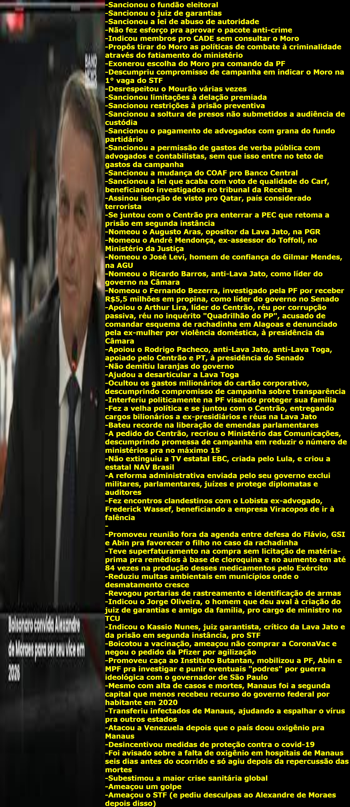

# Betrayal List Generator

If you are a chronically online brazilian somewhat interested in politics, you've probably already saw an image like this

which points out a list of betrayals our ex-president Jair Bolsonaro did to the brazilian rightists. The image, once controversial between rightists, now became just an niched meme.

Now, you can create your own Betrayal List with this powerful tool! Select the most goofy image of the nasty traitor, input your most poison injected words agains't the light-in-the-end-of-the-tunnel-that-was-actually-an-train and generate. The power of somewhat discussing highly personalist politics that journalists swear to God that is politized and polarized in the palm of your hands!
